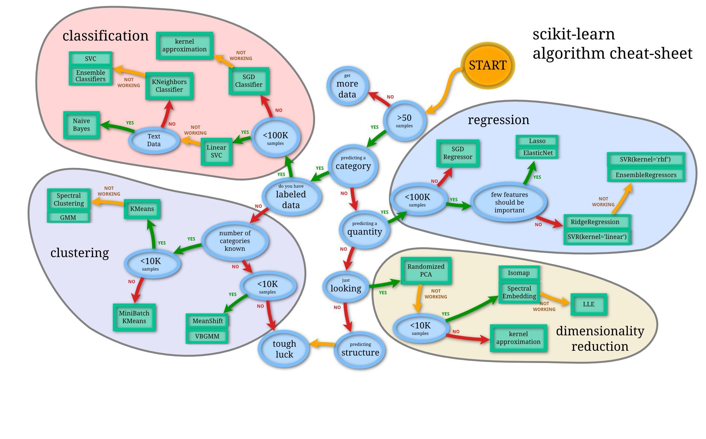
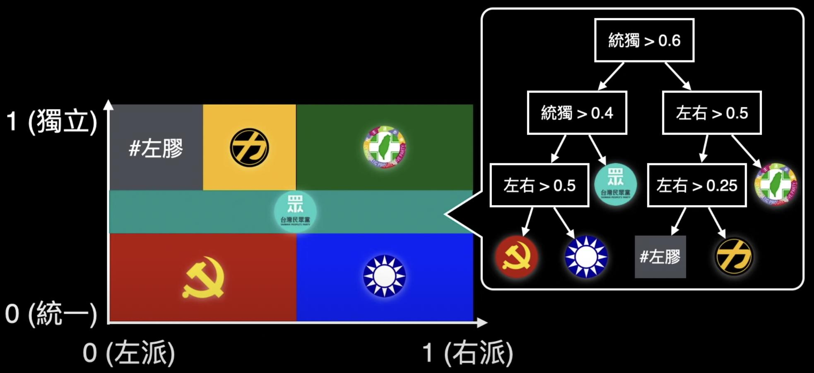

### ToC
- [Models](#models)
    - [Estimator](#estimator)
    - [Models](#Models)
        - [Dimensionlity Reduction](#dimensionlity-reduction)
        - [regression](#regression)
        - [Classification分類](#classification分類)
        - [RL](#RL)
    - [Deep Learning](#deep-learning)
        - [Convolutional Neural Network](#convolutional-neural-network)
        - [Generative Adversarial Network](#generative-adversarial-network)
        - [Natural Language Processing](#natural-language-processing)
- [cleaning and preprocessing](#cleaning-and-preprocessing)
    - [缺失值](#缺失值)
    - [切割訓練集與測試集](#切割訓練集與測試集)
    - [平均及變異數標準化](#平均及變異數標準化)

### Models 
---
Steps
- 定義問題，經過需求討論與評估後有個明確的目標並開始執行專案。
- 搜集資料，由於各場域所收集到的原始數據可能尚未整理以及格式尚未統一。因此資料清理極為重要，有個乾淨的資料可以對模型表現有大幅的提升。
- 資料一切就緒後在建模之前先對資料進行視覺化分析，並為數據做前處理以及專業知識的特徵工程。
- 對資料有認識後，接著挑選合適的機器學習演算法訓練與評估模型。
- 在模型正式上線之前，先透過測試集或是交叉驗證等機制確認模型泛化能力。
- 模型確認沒有問題後即可將模型打包輸出，並且與實際場域應用進行整合。
- 部署模型以及維運，持續將場域蒐集到的新資料進行再訓練，形成一個開發循環。

將演算法分為兩大類，依照用來訓練的歷史資料有沒有標準答案：
- 監督式學習 Supervised Learning
- 非監督式學習 Unsupervised Learning

-  需要考慮每個演算法的特性與前提假設。
    - 例如線性回歸法是基於特徵與結果之間有某種程度的線性關係為前提。  
若遇到非線性關係的狀況，就不適用。  
    - 例如單純貝氏分類器是基於特徵之間兩兩相互獨立為前提。  
若遇到特徵之間有相依性的狀況，就不太適用
    - 像是資料量的大小、模型效能與準確度之間的取捨等

#### Estimator 
在歷史資料都有標準答案的情形下，試著找出符合特徵與結果之間關聯性的模型，新資料就能套用相同的模型而得出適當的預測結果。

#### Models
---
#### dimensionlity-reduction
dimensionlity reduction

#### regression
- 線性回歸法 Linear Regression
找出事件特徵與結果之間的數學線性關係，根據這樣的資訊就能合理推斷出特徵與結果之間的關聯，而資訊愈來愈多時，也能利用梯度下降 Gradient Descent 之類的技巧，找出最符合所有資料的回歸線，進而獲得一個用特徵來預測結果的模型。

 

#### Classification分類

- 邏輯回歸法 Logistic Regression
面對非此即彼的分類問題，可以把特徵與結果之間的關聯投射回歸到一個 0 與 1 的邏輯曲線上，0 代表其中一類，1 代表另外一類，以得到一個把任意數值對應到適當分類的模型。

- 決策樹 Decision Tree
是利用特徵與分類結果之間的關係，由歷史資料來建構出一棵充滿著「不同條件伴隨相應情境」的決策樹，讓不同的特徵落入對應的適當分類的模型。

- 隨機森林法 Random Forest
面對同樣的問題，為了避免單一特徵的重要性被過度放大而造成偏差。  
如果隨機挑選部分特徵來建構多棵決策樹，最後再用投票的方式來決勝負(選舉最大的重點就是票多的贏、票少的輸)，將會得出比單一決策樹更全面更正確的答案。

- 梯度提升樹 Gradient Boosted Decision Trees, GBDT
策略性逐步建構多棵決策樹模型，間接讓重要的特徵佔有更多權重，得到準確度更高的決策樹森林。

- 最近鄰居法 K-Nearest Neighbors, KNN
在現有歷史資料的基礎上，對於想預測的新資料，直接比對特徵最接近的 K 筆歷史資料，看他們分別屬於哪個分類，再以投票來決定新資料的所屬分類(選舉最大的重點就是票多的贏、票少的輸)。

- 單純貝氏分類器 Naïve Bayes Classifier
在已知特徵之間相互獨立互不影響的前提下，就能利用貝氏定理，算出個別特徵與結果之間的機率關係
以此來預測不同特徵條件落入不同分類的個別機率

$$P(A|B) = \frac{P(B|A)P(A)}{P(B)}$$

- 支持向量機 Support Vector Machine, SVM
在不同分類群體之間找出一條分隔線，使邊界距離最近的資料點越遠越好，以此來達到分類的目的。

#### clustering分群
資料沒被分類，自動將其分群

- K-平均算法 K-Means Clustering
先從所有資料當中亂數選擇 K 個中心點，就能把個別資料依照最近的中心點分成 K 群，將每一群的平均值當成新的 K 個中心點，再分成 K 群。
以此類推，最終資料將收斂至 K 個彼此相近的群體

#### RL

- 強化學習 Reinforcement Learning, RL
在沒有歷史資料的情況下，把代理人，也就是模型直接丟到使用環境當中，透過一連串的動作，來觀察環境狀態，同時接受來自環境的獎勵或懲罰反饋來動態調整模型。經過訓練，模型就能自動做出能獲得最多獎勵的動作。

### Deep-learning

將類神經網路 Neural Networks，演變深度學習 Deep Learning，把大腦神經元的機制，以數位邏輯的方式來模擬，稱之為感知器 perceptron。  
其中包含 m 筆輸入 x，一個偏置 bias，經過權重 weights 相乘並加總之後，再通過一個激活函數 activation function 來模擬大腦神經元的電位閥值機制，最終輸出這個節點被激活的程度，傳遞至下一層的 perceptron。

由於現實中要解決的難題大多不會有簡單的線性解，通常會選用非線性函數的 activation function：
> 介於 0 與 1 之間的 sigmoid；  
介於 -1 與 1 之間的 tanh；  
最常被使用的 ReLU 或者其他變形。  

把很多個 perceptron 分層相互連接起來，就形成一個 deep learning 的模型架構

訓練這個模型，把資料一筆一筆餵進去，先進行正向傳播 forward propagation。
將得出的輸出結果與標準答案帶入損失函數 loss function，算出兩者之間的差異。
再以 gradient descent 之類的最佳化函數 optimizer
進行反向傳播 backward propagation，
以減少差異為目標，來調整每一個 perceptron 裡的權重 weights。

只要資料量夠多，**模型輸出與標準答案之間的差異** 就會在資料一筆一筆正向反向流入模型的自我修正當中逐漸收斂減小。一旦經由模型得出的答案，與標準答案的差異小到某個可以接受的程度，就表示這個模型是訓練好的可用的模型。

#### Convolutional-Neural-Network

在電腦視覺Computer vision領域可以使用捲積神經網路 Convolutional Neural Network，CNN。  
先用小範圍的濾鏡 filters 來取得影像的邊緣、形狀等等特徵，再把這些富有意義的特徵接到前面提到的 Deep Learning 模型，就能有效識別圖片或影像中的物體。

#### Generative-Adversarial-Network

生成對抗網路 Generative Adversarial Network，GAN。   
透過兩個 Deep Learning 模型相互抗衡：模仿的生成模型 generator 產生假資料，交由判別模型 discriminator 來判斷資料真假。  
透過生成模型產生出來的假資料，使判別模型分不清真假。  
常見領域為模仿影像或藝術風格方面。

#### Natural-Language-Processing

自然語言處理 Natural Language Processing，NLP。
有順序性資料的處理，傳統可以使用遞歸神經網路 Recurrent Neural Network
或簡稱 RNN，把每次訓練的模型狀態傳遞至下一次訓練，以達到有順序性的短期記憶的功效。

改善 RNN 的長期記憶遞減效應，為進階版本的長短期記憶神經網路 Long-Short Term Memory，LSTM。

Transformer，概念上是使用注意力 attention 的機制，讓模型直接針對重點部分進行處理。

> src  
[jasonmel](https://www.youtube.com/watch?v=UGdG4WpluJ8&t=407s&ab_channel=jasonmel)

### Cleaning-and-Preprocessing
---
透過資料清理和前處理，多組特徵間，範圍差異性可能會很大，資料前處理可以加速收斂速度。  
演算法對數據範圍非常的敏感。因此為了要讓模型訓練的更優，通常的做法是對特徵進行調節**做特徵的正規化**，使得數據更適合這些演算法。  

#### 缺失值
由於 Sklearn 所提供的資料集非常乾淨，若收集到的資料有許多的缺失值或是本身資料量就不多的情況下，建議好好的去處理這些缺漏的值。
- missing value
    > 缺失值使用的時機:
    > - 當只有少量的缺失值適用:  
    使用 numpy 所提供的函式來檢查是否有 NA 缺失值，假設有缺失值使用 `dropna()` 來移除。  
    > - 遇到有大量缺失值、或本身的資料量就很少
    建議可以透過機器學習的方法補值來預測缺失值。     
     

    > 通常補值的方法分為手動填值與插值法： 
    > - 手動填值  
    > - 以該欄位所有資料的算術平均數或中位數做填補的依據。  
    > - 使用以出現頻率最高的值做填補。  
    > - 差值法是透過時間或空間上的技巧處理這些缺值，例如當資料是有時間序列的因素存在時，可以利用該筆缺失欄位附近的時間點的資料加總並平均。

#### 切割訓練集與測試集

Sklearn 提供 `train_test_split()` 方法為資料進行訓練集與測試集的切割，經由參數設定來讓切割的資料更多樣性。  
- train_test_split()
    > 1. 其中 `test_size` 參數就是設定測試集的比例，設定 0.3 即代表訓練集與測試集的比例為 7:3。
    > 2. 預設資料切割的方式是隨機切割 `shuffle=True` 對原始數據進行隨機抽樣，以保證隨機性。若想要每次程式執行時切割結果都是一樣的可以設定亂數隨機種子 `random_state` 並給予一個隨機數值。
    > 3.  `stratify` 分層隨機抽樣，特別是在原始數據中樣本標籤分佈不均衡時非常有用。使用時機是確保分類問題 y 的類別數量分佈要與原資料集一致。以免資料集切割不平均導致模型訓練時有很大的偏差。

#### 平均及變異數標準化
Standardization 

> - 標準正態分佈化的類:    
class preprocessing.StandardScaler(copy=True, with_mean=True, with_std=True):   
>    - scale_: ndarray, 縮放比例
>    - mean_: ndarray, 均值 (常設定為0)
>    - var_: ndarray, 方差 (常設定為1)
>    - n_samples_seen_: int, 以處理的樣本個數, 調用partial_fit()時會累加, 調用fit()時會重設

> - 將數據縮放在固定間的類，默認縮放到區間[0, 1]  
class preprocessing.MinMaxScaler(feature_range=(0, 1), copy=True):   
>    - min_: ndarray, 縮放後的最小值偏移量
>    - scale_: ndarray, 縮放比例
>    - data_min_: ndarray, 數據最小值 (常設定為0)
>    - data_max_: ndarray, 數據最大值 (常設定為1)
>    - data_range_: ndarray, 數據最大最小範圍的長度

> - 數據的縮放比例為絕對值最大值，並保留正負號，即在區間內[-1.0, 1.0]內。  
可以用於稀疏數據scipy.sparse   
class preprocessing.MaxAbsScaler(copy=True):  
>    - scale_: ndarray, 縮放比例
>    - max_abs_: ndarray, 絕對值最大值
>    - n_samples_seen_: int, 已處理的樣本個數
    
    
> - 算出四分位距，讓離均值不參與做計算。  
通過interquartile Range(IQR)標準化數據，即四分之一和四分之三分位點之間。   
class preprocessing.RobustScaler(with_centering=True, with_scaling=True, copy=True):    
>    - center_: ndarray, 中心點
>    - scale_: ndarray, 縮放比例
    
    

